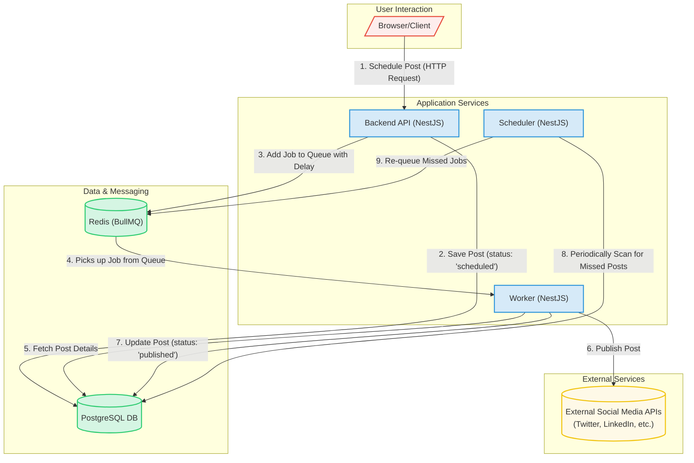

# System Architecture for Scheduled Posts

This document outlines the architecture for the scheduled posts feature, based on the provided plan. It details how the different services (`backend`, `worker`, `scheduler`) communicate with each other and with shared resources like Redis and PostgreSQL.

## Architecture Diagram

The following diagram illustrates the flow of information and the interactions between the components.

## Communication Flow

Here is a detailed breakdown of how the services communicate:

### 1. **Backend API (`backend`)**
*   **Role**: Handles direct interaction with the user/frontend. It is the entry point for creating and managing posts.
*   **Communication**:
    *   **Receives**: HTTP requests from the frontend to schedule a post. The request includes the post content, credentials, and the desired `scheduledAt` time.
    *   **Sends (Outbound)**:
        1.  **To PostgreSQL**: It writes the new post data to the `posts` table with a `status` of `'scheduled'`. This serves as the source of truth.
        2.  **To Redis (BullMQ)**: After saving the post, it calculates the delay until the scheduled time and adds a new job to the `post-queue`. This job contains the `postId` and any necessary credentials for the `worker` to process it.

### 2. **Redis (with BullMQ)**
*   **Role**: Acts as a message broker and job queue. It decouples the `backend` from the `worker`, ensuring that post-processing happens asynchronously and reliably.
*   **Communication**:
    *   **Receives**: Jobs from the `backend` and the `scheduler`. BullMQ stores these jobs and delivers them to available workers only when their delay has expired.
    *   **Sends (Outbound)**: It pushes jobs to any connected `worker` that is listening to the `post-queue`.

### 3. **Worker (`worker`)**
*   **Role**: The workhorse of the system. Its sole responsibility is to process jobs from the queue and perform the actual task of publishing a post.
*   **Communication**:
    *   **Receives**: Jobs from the `post-queue` in Redis.
    *   **Sends (Outbound)**:
        1.  **To PostgreSQL**: Upon receiving a job, it queries the database using the `postId` from the job data to get the full post content.
        2.  **To External APIs**: It uses the post content and credentials to make an API call to the target social media platform (e.g., Twitter).
        3.  **To PostgreSQL (Again)**: After successfully publishing, it updates the post's `status` in the database to `'published'`. If an error occurs, it updates the `status` to `'error'` and records the error message.

### 4. **Scheduler (`scheduler`)**
*   **Role**: A fail-safe mechanism. It ensures that no scheduled posts are missed, for instance, if the `backend` fails to queue a job or if the system restarts.
*   **Communication**:
    *   **Receives**: Nothing directly. It runs on a timer (e.g., a cron job).
    *   **Sends (Outbound)**:
        1.  **To PostgreSQL**: On its schedule (e.g., every minute), it queries the database for posts that have a `status` of `'scheduled'` and a `publishDate` in the past.
        2.  **To Redis (BullMQ)**: If it finds any missed posts, it adds them to the `post-queue` with a delay of `0` to be processed immediately by the `worker`. It then updates the post's `status` to `'queued'` in the database.

This architecture creates a resilient, scalable, and maintainable system where each component has a clear and distinct responsibility.

<!-- nest new my-project --monorepo -->